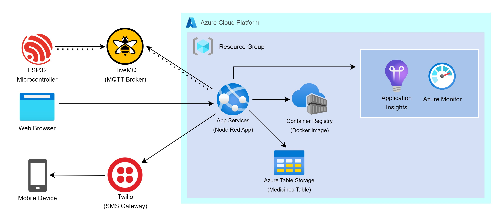

<h1 align="center">💊 Smart Medicine Box 💊</h1>

<h2 align="center">🏢 System Architecture 🛠️</h2>

<h2 align="center">📚 Project Description 📚</h2>

The Smart Medicine Box is a system that helps the user to keep track of their medicine intake. System consists of multiple components, coorperating with each other to provide a comprehensive set of functionalities. Here's a detailed list of features:

Menu Functionalities:

1) Set Time Zone:
    Accepts the offset from UTC as input to set the time zone.
2) Set Alarms:
    Allows setting of up to 3 alarms.
3) Disable Alarms:
    Provides an option to disable all alarms.

Time Synchronization:

4) Fetch and Display Time:
    Fetches the current time from the NTP server based on the selected time zone and displays the current time on the OLED screen.

Alarm Management:

5) Alarm Indication:
    Rings the alarm with proper indication when the set alarm times are reached. Further provides suitable indications such as turned on LED and an message on OLED.
6) Stop Alarm:
    Allows to use a push button to stop the ringing alarm.
7) Disable All Alarms:
    Provides an option to disable all alarms.

Environmental Monitoring:

8) Monitor Temperature and Humidity:
    Continuously monitors temperature and humidity levels, providing warnings using proper indications when either or both exceed the healthy limits (Temperature: 26°C to 32°C, Humidity: 60% to 80%).

Light Intensity Monitoring:

9) Measure Light Intensity:
    Uses two LDRs to measure light intensity on either side of the Medibox. Then displays the highest light intensity on the Node-RED dashboard. Indicates from which LDR (left or right) the highest light intensity is obtained. Uses a gauge to display real-time highest intensity and a plot to visualize past variations. Intensity values are normalized to a range of 0 to 1 (0 for analog reading 0 and 1 for analog reading 1023).

Light Control Mechanism:

10) Shaded Sliding Window:
    Uses a servo motor to adjust the angle of the shaded sliding window to regulate light intensity entering the Medibox. Implements dynamic adjustment of the window based on the light intensity using a given controlling factor.

User Interface Enhancements:

11) Adjust System Parameters:
    Allows user to adjust the minimum angle and controlling factor using sliders on the Node-RED dashboard. Provides slider controls for the minimum angle (range 0 to 120) and the controlling factor (range 0 to 1).

12) Medicine-Specific Settings:
    Includes a dropdown menu with options for commonly used medicines and a custom option. Automatically applies predefined values for the minimum angle and controlling factor based on the selected medicine. Allows manual adjustment of values when the custom option is selected.

By implementing these functionalities, the Medibox effectively assists users in managing their medication schedules, while also ensuring the safe storage of medicines through environmental monitoring and dynamic light control.

Refer `dev` branch for deployment guidelines.
