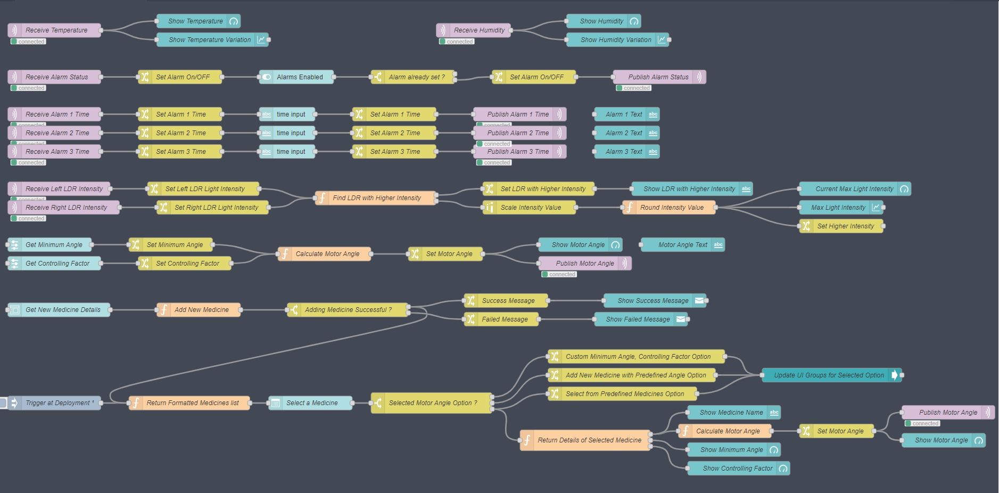

# Medibox - v1.0

### Circuit Diagram

### Features

#### Enable/Disable Alarms and Set Alarm Times

#### Set Custom Motor Angles

#### Add New Medicines with Predefined Motor Angle

#### Select a Saved Medicine to Update Motor Angle

### Node Red Flow Diagram

